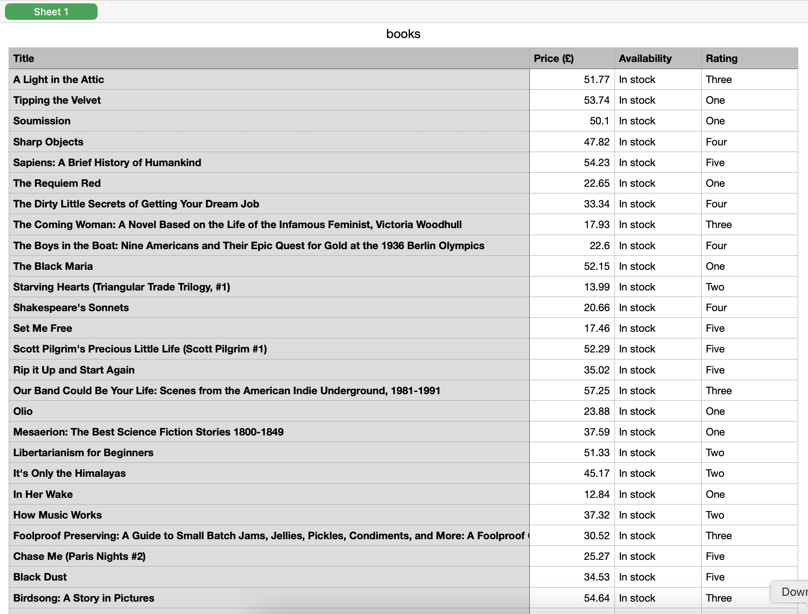
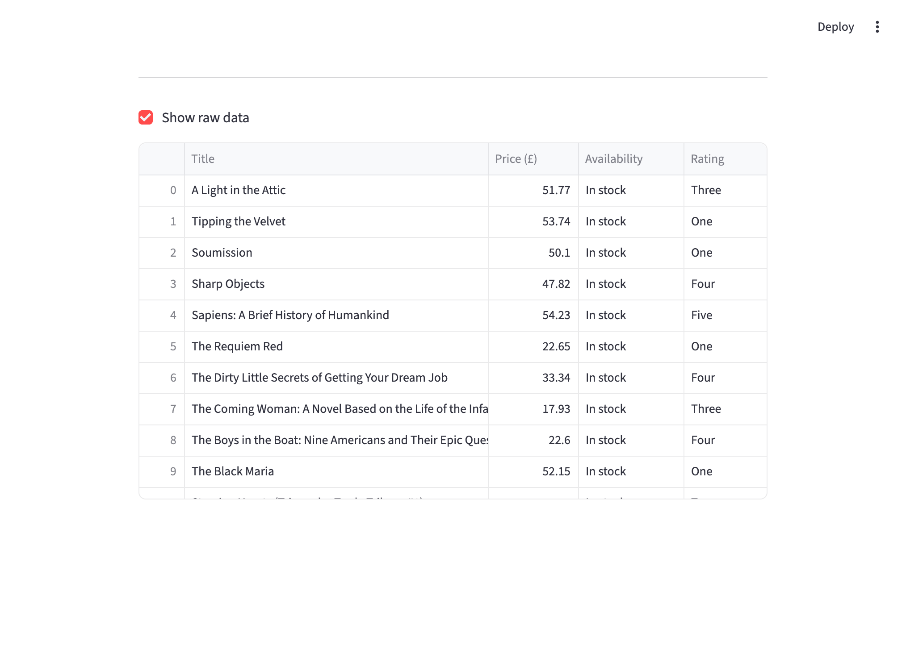

# 📚 Book Price Intelligence Scraper

## Overview
This project scrapes book data from http://books.toscrape.com and visualizes it using an interactive dashboard.

## Features
- Scrapes 1000+ books
- Handles pagination
- Extracts title, price, and availability
- Stores data in CSV
- Interactive dashboard using Streamlit

## Tech Stack
- Python
- BeautifulSoup
- Pandas
- Streamlit
- Matplotlib

## How to Run

### 1. Install dependencies
pip install -r requirements.txt

### 2. Run scraper
python books_to_scrape.py 

### 3. Run dashboard
python3 -m streamlit run books_to_scrape_dashboard.py

## Sample Output
- CSV dataset of books
- Dashboard with price insights, metrics, and filters.

## Use Case
Designed for e-commerce monitoring, price analysis, and inventory tracking.

## Screenshots

